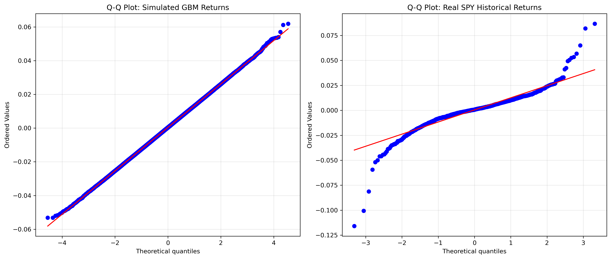

# Geometric Brownian Motion: Empirical Calibration and Distributional Critique

## Objective
To implement a vectorized Geometric Brownian Motion (GBM) simulation engine, calibrate it using empirical market data (S&P 500), and statistically evaluate the model's assumptions against historical return distributions, specifically focusing on tail-risk and leptokurtosis.

## Mathematical Framework

The simulation is based on the standard continuous-time Stochastic Differential Equation (SDE) for stock prices:

$$dS_t = \mu S_t dt + \sigma S_t dW_t$$

Where:
*   $\mu$ is the expected return (drift)
*   $\sigma$ is the volatility
*   $dW_t$ is a Wiener process (Standard Brownian Motion)

To simulate this computationally, we apply Itô's Lemma to solve for the discrete-time exact solution:

$$S_{t+\Delta t} = S_t \exp\left( \left( \mu - \frac{\sigma^2}{2} \right)\Delta t + \sigma \sqrt{\Delta t} Z \right)$$

where $Z \sim \mathcal{N}(0,1)$. The term $-\frac{\sigma^2}{2}$ serves as the necessary Itô convexity adjustment.

## Implementation Details

*   **Empirical Calibration:** Drift ($\mu$) and volatility ($\sigma$) are not hardcoded. They are dynamically estimated from historical daily log-returns of the `SPY` ETF using the `yfinance` API, annualized under the assumption of 252 trading days.
*   **Computational Efficiency:** The simulation logic bypasses standard Python `for` loops. Path generation is entirely vectorized using `numpy` multi-dimensional arrays, allowing for the instantaneous calculation of 1,000 parallel paths over a 252-day horizon.

## Empirical Critique: The "Fat Tail" Problem

While GBM provides a computationally elegant foundation for derivative pricing (e.g., the Black-Scholes model), this project empirically demonstrates its critical failure in pure risk management: the assumption of normally distributed log-returns.

### Statistical Analysis
By projecting terminal prices and analyzing the distribution of simulated vs. historical log-returns, we observe a severe divergence in higher-order statistical moments.

*   **Simulated Returns Excess Kurtosis:** ~ 0.00 (Perfectly Normal)
*   **Historical SPY Returns Excess Kurtosis:** > 5.00 (Highly Leptokurtic)

### Q-Q Plot Evaluation

The Quantile-Quantile (Q-Q) plot visualizes this discrepancy. The simulated returns map perfectly to the theoretical normal distribution (the straight red line). In stark contrast, the historical S&P 500 returns exhibit an "S-curve" deviation at the extremities. 

**Conclusion:** The standard GBM model systematically underestimates the frequency and magnitude of extreme market events (market crashes and massive rallies). For true risk-management applications, models incorporating stochastic volatility (e.g., Heston) or jump-diffusion (e.g., Merton) are required to capture the empirical reality of financial markets.
